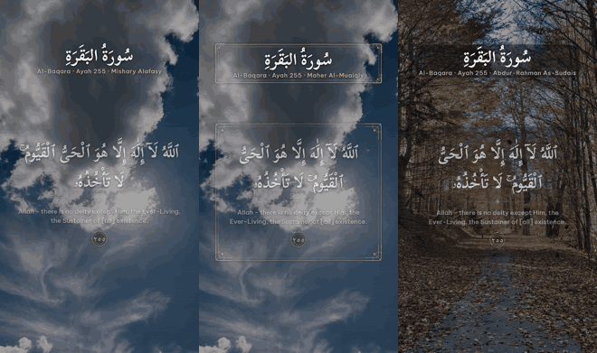
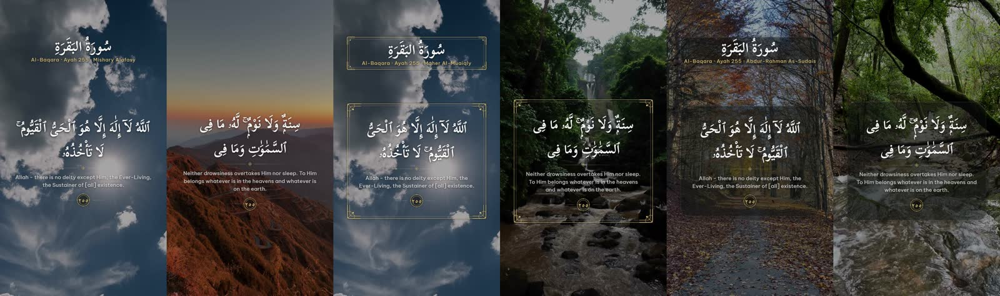
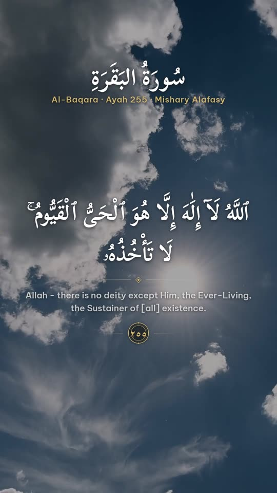
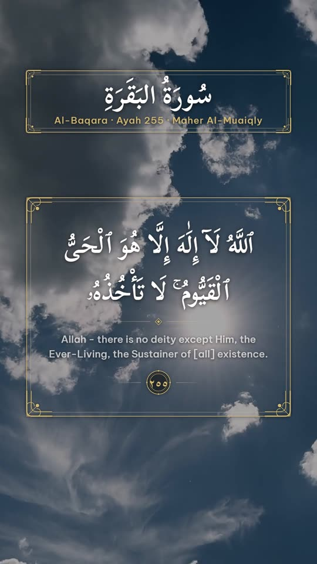
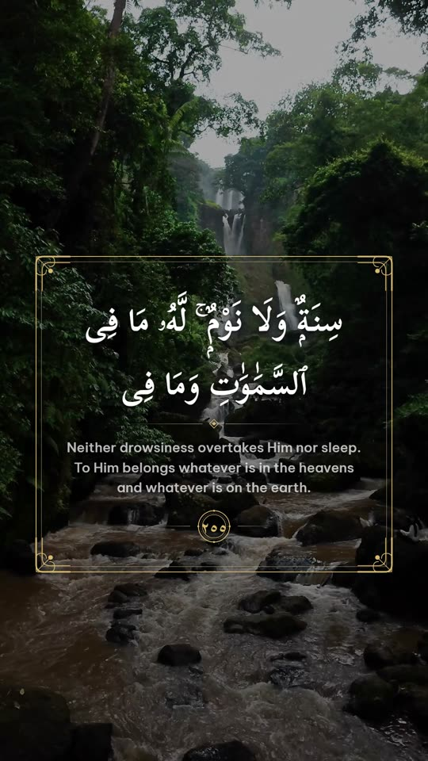
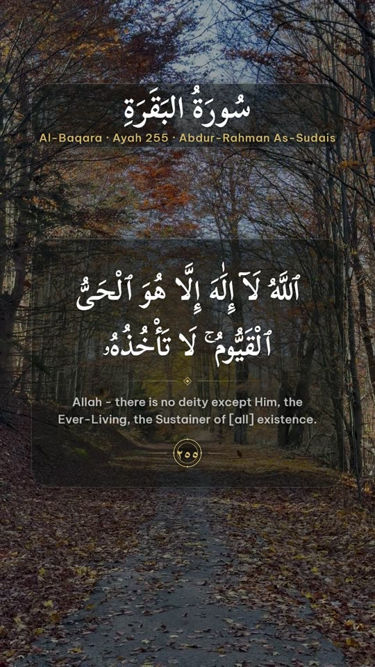
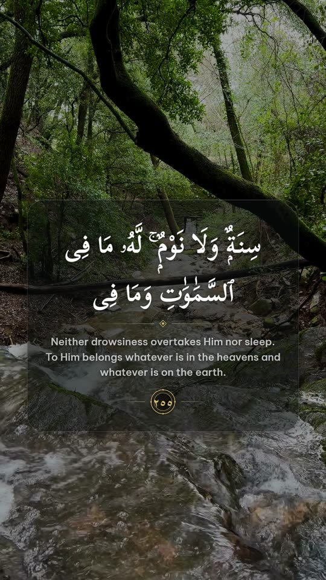

# ayatMaker

Standalone generator of vertical Quran videos (1080x1920, 30 fps, H.264 + AAC): recitation audio from a chosen reader,
the Arabic text and an English translation over nature footage. No TTS and no LLM are involved.



*Silent 6-second preview of the three templates on Ayat al-Kursi (2:255). The repository does not ship the full videos
because the audio belongs to the reciters; generate them locally with the commands below.*

## What it does

For a surah and ayah range it fetches the verse text and the reader's audio, trims silence from each ayah recording,
renders a title card and verse overlays from HTML templates (Playwright/Chromium), and composes them over stock or
personal footage with FFmpeg. Everything is cached, so repeated runs make no network calls.

## Screenshots

Surah 2, ayah 255. Left to right: title card and verse frame for `elegant` (Alafasy), `gold-frame` (Maher Al-Muaiqly)
and `glass` (As-Sudais).



| Template | Title card | Verse |
|---|---|---|
| elegant |  |  |
| gold-frame |  |  |
| glass |  |  |

## Features

- Readers: `alafasy`, `mahermuaiqly`, `sudais`.
- Texts: Arabic (Uthmani script) and English (Sahih International), used exactly as returned by the API.
- Vertical 1080x1920, 30 fps, H.264 + AAC.
- Three templates: `elegant`, `gold-frame`, `glass`. `--template auto` (batch) rotates them, fixed per video.
- Audio silence trimming at the start and end of each ayah, with a fixed 0.2 s gap between ayahs.
- Footage from Pexels and/or your own clips in `my_clips/` (`--clips pexels|mine|mixed`).
- Exclusion list (`exclude.txt`) for clips that must never be used.
- `.clips.json` next to every video lists each clip used (source, Pexels id, URL or path, start time).
- Batch mode with resume: existing outputs are skipped.

## Results

Measured on the six videos in `output/` (probed with the bundled imageio-ffmpeg FFmpeg build).
All six: 1080x1920, 30 fps, H.264 High (yuv420p) video, AAC-LC 96 kHz stereo audio.

| Video | Duration (s) | Audio (s) | Size (MB) |
|---|---|---|---|
| 2:255 alafasy elegant | 52.94 | 52.94 | 51.9 |
| 2:255 mahermuaiqly gold-frame | 42.94 | 42.94 | 46.9 |
| 2:255 sudais glass | 38.92 | 38.92 | 81.5 |
| 112 alafasy elegant | 13.72 | 13.72 | 15.2 |
| 112 mahermuaiqly gold-frame | 10.36 | 10.36 | 10.3 |
| 112 sudais glass | 14.77 | 14.78 | 14.2 |

Comparison with the earlier MoneyPrinterTurbo-based outputs for the same six files (durations recomputed with FFmpeg):

| Video | Earlier (s) | ayatMaker (s) | Difference (s) |
|---|---|---|---|
| 2:255 alafasy | 52.94 | 52.94 | 0.00 |
| 2:255 mahermuaiqly | 42.94 | 42.94 | 0.00 |
| 2:255 sudais | 38.92 | 38.92 | 0.00 |
| 112 alafasy | 13.72 | 13.72 | 0.00 |
| 112 mahermuaiqly | 10.36 | 10.36 | 0.00 |
| 112 sudais | 14.72 | 14.77 | +0.05 |

Pipeline facts (measured or read from the code and templates):

- The title card sits at the top (roughly y 233-458 of 1920); the verse area is y 520-1570.
- Ayahs are joined with a 0.2 s gap. `silencedetect` (-40 dB, min 0.15 s) on
  `quran_112_1-4_mahermuaiqly_gold-frame.mp4` finds silences of 0.32 s between ayahs (2.41-2.73, 4.25-4.57 and
  6.60-6.92 s) and 0.55 s at the end of the file (9.82-10.37 s).
- Rebuilding one short video from cache (surah 112, all ayahs, sudais, glass, 14.8 s) took about 46-48 s
  (two runs: 45.7 s and 47.5 s). Cached footage and audio, no network; the time is dominated by rendering and encoding.
  This was measured once on one machine; build times of uncached runs were not measured.
- The default `batch.json` plans 15 videos (surahs 2:255, 112, 113, 114 and 1, each with the three readers);
  6 exist in `output/`, 9 are planned.

## Requirements

- Windows with PowerShell (the setup script is PowerShell; the code itself is plain Python)
- Python 3 (tested with 3.13)
- A free Pexels API key (only when using Pexels footage)
- Dependencies are installed by `setup.ps1`: see `requirements.txt` (includes Playwright and its Chromium, and a bundled FFmpeg)

## Quick start

```powershell
.\setup.ps1        # creates .venv, installs requirements, installs Playwright Chromium
```

Copy `config.example.toml` to `config.toml` and set `pexels_api_key` (or set env `PEXELS_API_KEY`). `config.toml` is
gitignored. A missing key gives a clear error.

Run one video (`--ayah` is `N` or `FROM-TO`):

```powershell
.\.venv\Scripts\python -m ayatmaker.make --surah 2 --ayah 255 --reader alafasy --template elegant --out output/
```

Output: `output/quran_{surah}_{ayahspec}_{reader}_{template}.mp4` (written to a temp file, then renamed).

Batch (resumable) and dry-run:

```powershell
.\.venv\Scripts\python -m ayatmaker.batch --config batch.json --out output --dry-run
.\.venv\Scripts\python -m ayatmaker.batch --config batch.json --out output [--template auto]
```

`batch.json` accepts `"ayah": "all"` and optional per-job `template`, `font` and `clips`.

## Fonts and licenses

`--font` accepts `scheherazade`, `scheherazade-bold` (default), `naskh`, `amiri` and `kfgqpc`. The bundled fonts
(Scheherazade New, Noto Naskh Arabic, Amiri Quran, Be Vietnam Pro) are SIL OFL 1.1; license texts and sources are in
`ayatmaker/templates/fonts/LICENSES.md` and `OFL-*.txt`.

The KFGQPC Uthmanic Hafs font is not bundled because it is published under KFGQPC's own terms, not the OFL. To use
`--font kfgqpc`, download it from the King Fahd Complex fonts page (https://qurancomplex.gov.sa) and save it as
`ayatmaker/templates/fonts/UthmanicHafs1-Ver09.woff2`. Without the file the command stops with a message showing this
path. See `ayatmaker/templates/fonts/FONTS.md`.

## Data, credits and licensing

- Quran text and audio come from the alquran.cloud API and the Islamic Network CDN (cdn.islamic.network). The
  reciters' recordings may carry their own rights: check them before commercial use.
- Footage from Pexels is under the Pexels license (https://www.pexels.com/license/). Your own clips are your responsibility.
- The Quran text is used exactly as returned by the API and is never generated or altered by AI. There is no TTS and no LLM.

## Known limitations

- No people filter on stock footage; use the exclusion list to drop unwanted clips.
- English is Sahih International only.
- The KFGQPC font is not bundled (see above).
- For some reciters the CDN falls back to a lower bitrate for some ayahs.
- Visual QA was done on extracted frames, not by full playback of every video.

## Your own clips and the exclusion list

`--clips {pexels,mine,mixed}` (make and batch; batch.json accepts a global `"clips"` and a per-job `"clips"`):
`pexels` = stock footage only, `mine` = only files in `my_clips/`, `mixed` = both pools shuffled together with the same
seed logic. Default: `mixed` if `my_clips/` has at least one usable clip, otherwise `pexels`.
`my_clips/` accepts mp4, mov, webm and mkv (subfolders included), any size, orientation or fps. Clips are converted to
1080x1920 30 fps (cover + center crop, audio removed) and cached in `cache/mine/` (keyed by path, size and mtime, so
editing a file re-converts it). Files that are unreadable or shorter than 2 s are skipped with a warning; longer clips
are cut at a seeded random offset, shorter ones loop. `mine` fails with a clear error when the folder has no usable clip.

`exclude.txt` lists clips that must never be used (`#` comments, one entry per line): a Pexels id, a Pexels URL, a cached
file name (`vid-<hash>.mp4`), a file or relative path under `my_clips/` (case-insensitive), or a glob such as
`my_clips/old/*`. Excluded items are dropped before selection and the count is logged.

```powershell
.\.venv\Scripts\python -m ayatmaker.exclude add 3571264        # or a Pexels URL / file name
.\.venv\Scripts\python -m ayatmaker.exclude list
.\.venv\Scripts\python -m ayatmaker.exclude remove 3571264
```

Every video `X.mp4` gets `X.clips.json` next to it and `make` prints the same list: for each clip in order its source,
Pexels id, original URL or local path, cached file name and start time in the video. To drop a clip you disliked, take
its `pexels_id` (or the file name from `origin` for your own clips) from that JSON, run `exclude add <it>`, and rebuild
the video (delete the old output first, since batch skips existing files).

License: not yet specified
